# Base de dados Births.csv

A base de dados _Births.csv_ se trata de um relatório de nascimentos nos Estados Unidos de 1969 a 2008, com detalhamento de ano, mês dia e gênero até 1988. A partir de 1989, os números passaram a ser consolidados por mês, porém ainda mantendo a separação por gênero.

## Tratamento dos dados

Os dados na base _Births.csv_ precisaram ser tratados para remover informações incorretas e que atrapalhariam as análises. Para isso, foi utilizada a biblioteca Pandas, transformando a tabela original em DataFrame e removendo dias incorretos.

Além disso, foram criadas colunas, pivot tables e funções para auxiliar na geração dos gráficos.

Para criação dos gráficos, foram utilizadas as bibliotecas Matplotlib e Seaborn.

## Dados observados

### Nascimentos por ano

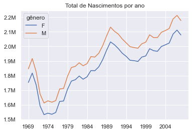

Gerando um gráfico que demonstra o total de nascimentos por ano, separados por gênero, foi possível notar uma queda acentuada no início da década de 70. Após isso, os nascimentos voltam a crescer na segunda metade da década e levam aproximadamente 10 anos para retornar aos números anteriores. 

É possível notar uma queda nos nascimentos na década de 90, porém menos brusca e mais longa.

### Diferença entre gêneros por ano
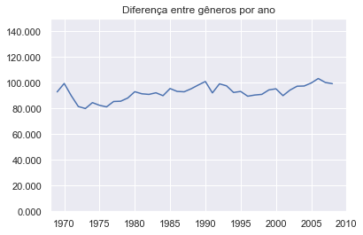

Esse gráfico foi criado para demonstrar a diferença de natalidade entre os gêneros que permanece consistente ao longo dos anos analisados.

### Nascimentos por dia da semana
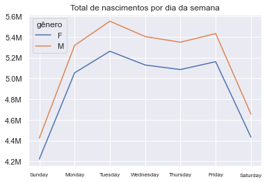

Dadas as limitações da base de dados, o gráfico demonstrando os nascimentos por dia da semana contemplam os dados de 1969 a 1988.

Nele, é possível notar uma maior incidência de nascimentos no meio da semana, principalmente na terça-feira. Essa diferença entre os dias permanece consistente entre os dois gêneros.

### Nascimentos por década
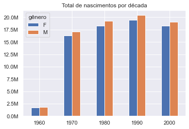

Consolidando os nascimentos por década, é possível notar um crescimento contínuo da natalidade, consistente entre gêneros, durante as décadas de 70 a 90.

É necessário ressaltar que, por começar em 1969, a década de 60 se encontra sub-representada. Para a década de 2000, os dados terminam em 2008, portanto não é possível afirmar com segurança se os nascimentos dessa década ultrapassariam a década anterior.

### Nascimentos por gênero a cada década (percentual)
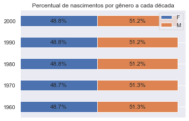

Ainda considerando os nascimentos por década, é possível notar que a quantidade de pessoas nascidas nos gêneros masculino e feminino é muito próxima, com pouca variação durante o período analisado.

Como um exemplo, a maior diferença ocorre no ano de 2006, onde nasceram aproximadamente 103 mil bebês do sexo masculino a mais do que do sexo feminino.

# Base de dados Brasil.csv

Identificamos na Base de Dados em questão diversos índices que se referem ao desenvolvimento social, econômico e populacional do país, dentre outras informações. Esses dados foram publicados em três anos específicos: 1991, 2000 e 2010, de modo a demonstrar a variação entre esses perídoso.

Realizamos a seleção de alguns dados em busca de insights relevantes para tratamento e demonstração de resultados através da ferramenta Power BI.

## Tratamento de dados

Os dados retirados da base _Brasil.csv_ foram tratados através da ferramenta Power BI com o objetivo de traduzir as informações para uma linguagem visualmente 'clean'. Efetuamos a alteração de formatação, inclusão e alteração de pontuações de forma automatizada e composição das colunas.

## Dados Observados

### Renda Per Capita R$

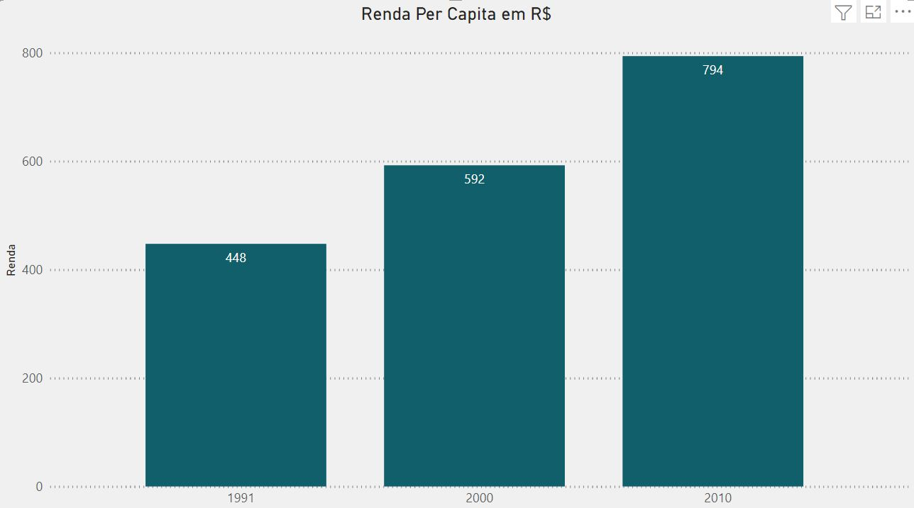

Neste dashboard utilizamos os dados referentes a Renda Per Capita por ano, de modo a verificar a variação da renda no Brasil e identificamos um crescimento de 77,23% entre os períodos de 1991 e 2010, portanto, podemos inferir uma melhora na qualidade de vida e consequentemente no crescimento da expectativa de vida dos brasileiros.

### Probabilidade de Sobrevivência até os 60 anos

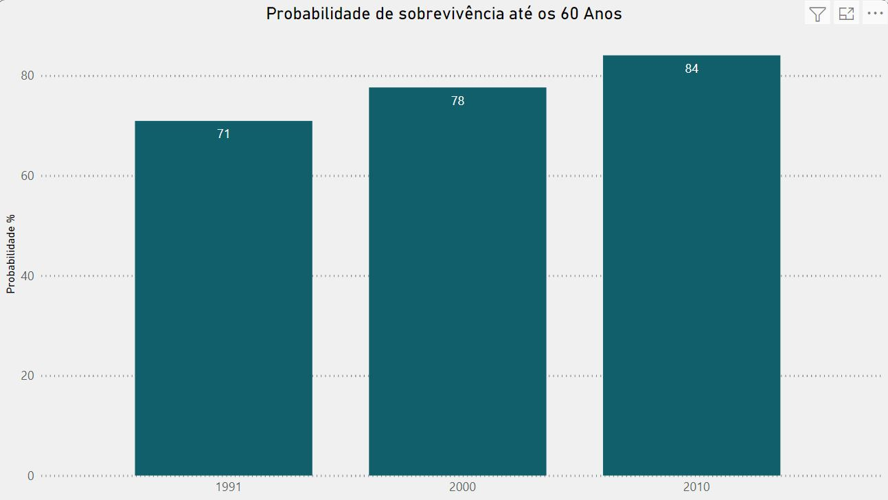

Para a composição desse gráfico realizamos o cruzamento de dados nos quesitos Ano calendário e Probabilidade de sobrevivência. Através das análises verificamos que em conformidade com o aumento da Renda, existe também um crescimento da probabilidade de sobrevivência nos períodos observados. Houve um crescimento da probabilidade que aproximava-se de 71% para o percentual de 84%, o que reforça o entendimento de que há uma evolução ao longo do tempo no Brasil.

### Expectativa de Vida

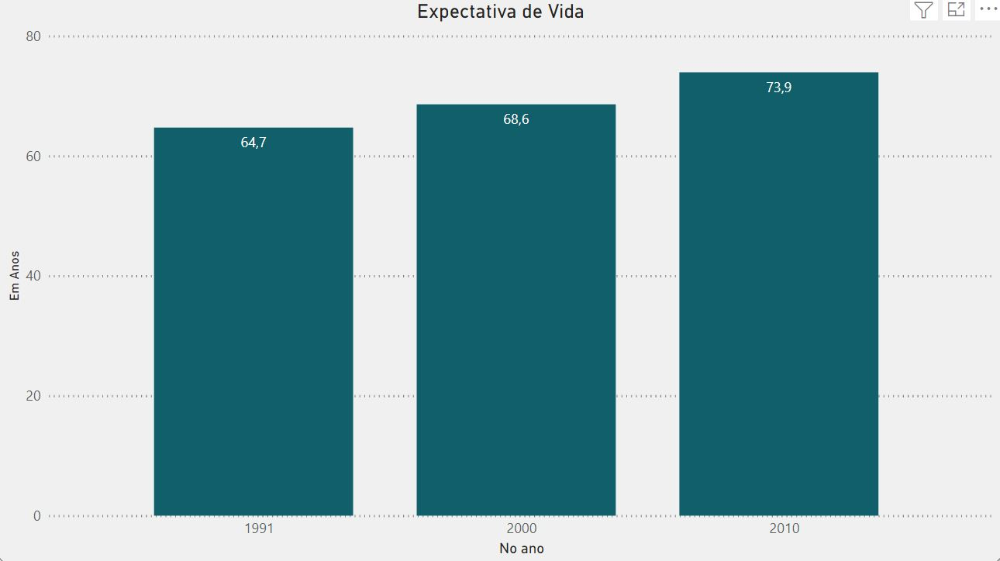

Para compor o gráfico utilizamos como base os dados referentes ao ano calendário e a Expectativa de vida observada para o respectivo período. Através dos dados informados é possível observar que há um crescimento na expectativa de vida dos brasileiros ao longo dos períodos saltando de 64 para 74 anos entre os anos de 1991 e 2010.

### Crescimento Populacional entre Homens e Mulheres

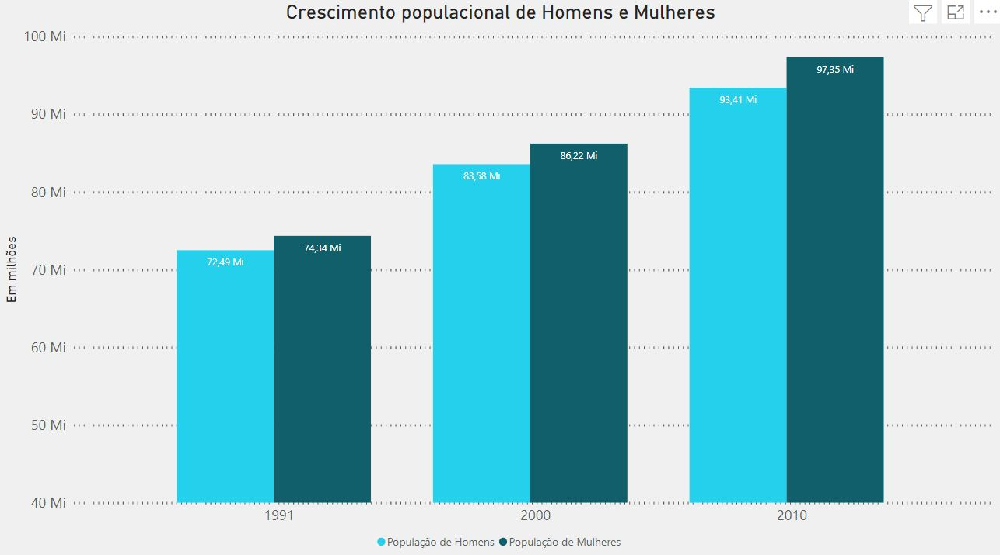

O dashboard demonstra o crescimento populacional no Brasil segregado entre a População de Homens e Mulheres nos períodos selecionados, de modo que os números destacados no gráfico representam a soma de cada População residente masculina e feminina.

Através da análise dos gráficos é possível inferir um crescimento populacional em ambas as populações analisadas entre os períodos, de modo que é possível depreender que o crescimento da População de mulheres é maior do que o crescimento identificado na População de homens bem como número de residentes mulheres se mantém maior que o de residentes homens durante todo o período analisado.

### Crescimento Populacional

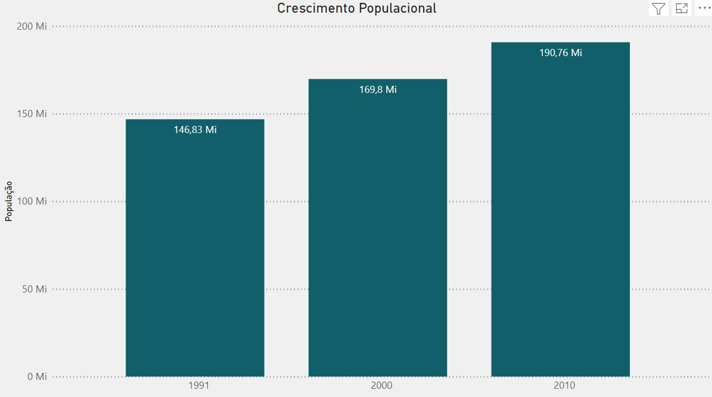

Ainda utilizando os dados de Ano e População podemos ver uma evolução, assim como nos outros gráficos, da população brasileira total ao longo dos anos. Em números, observamos um aumento significativo da população total que era de 146 milhões em 1991 para cerca de 190 milhões em 2010.

### Evolução da População Urbana e Rural

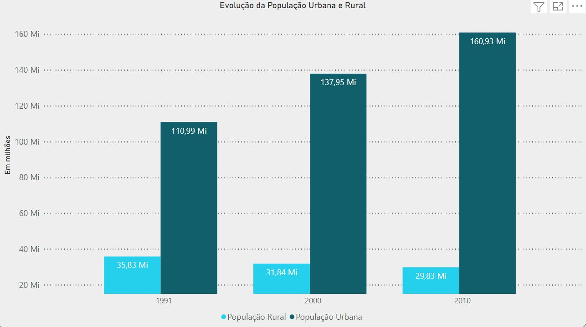

O gráfico apresenta a variação da População Urbana e População Rural demonstrada nos períodos dos anos de 1991, 2000, 2010 de modo que os números destacados no gráfico representam a soma do número de indivíduos residentes nas áreas Rurais e Urbanas no país.

A análise dos gráficos nos permite destacar que apesar do aumento exponencial da população é possível identificar a redução do número de residentes em áreas rurais que era de cerca de 35 milhões de indivíduos em 1991 e foi reduzida para menos de 30 milhões em 2010, portanto, há uma evasão aparente da população rural para as áreas urbanas no decorrer dos anos analisados.
